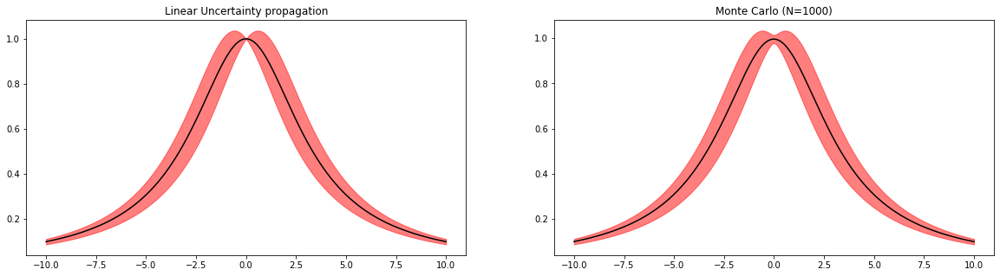

# Luprox

Linear uncertainty propagation using JAX transformations 

## Example

```python
from luprox import linear_uncertainty

@linear_uncertainty
def f(x):
    return 1/(1+jnp.abs(0.3*x)**2)

# Inputs
x = jnp.array([2.])
covariance = jnp.array([[0.05]]) # Covariance matrix for x (scalar for 1D random variables)

# Get output and covariance estimates
mu_linear, cov_linear = f(test_point, cov_x)
```

Results:
```
STD: 0.04352208226919174 (Linear) | 0.04308144003152847 (MC)
```

