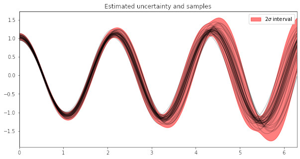

# Luprox

Linear uncertainty propagation using JAX transformations 

## Examples


### Non linear function

```python
from luprox import linear_uncertainty

@linear_uncertainty
def f(x):
    return 1/(1+jnp.abs(0.3*x)**2)

# Inputs
x = jnp.array([2.])
covariance = jnp.array([[0.05]]) # Covariance matrix for x (scalar for 1D random variables)

# Get output and covariance estimates
mu_linear, cov_linear = f(test_point, cov_x)
```

Results:
```
STD: 0.04352208226919174 (Linear) | 0.04308144003152847 (MC)
```


### Damped pendulum simulation
```python
# Integration interval
t = jnp.arange(0., 6.3, 0.01)

# Damped pendulum simulation with uncertainty
@linear_uncertainty
def solve_pendulum(params):
    g = params[0]
    L = params[1]
    alpha = params[2]
    u0 = params[3:]
    
    def damped_pendulum(u, t):
        theta = u[0]
        vel = u[1]
        d_theta = u[1]
        d_vel = - (g/L)*jnp.sin(u[0]) - alpha*u[1]
        return jnp.stack([d_theta, d_vel])
    
    trajectory = euler_integration(damped_pendulum, u0, dt, t)
    return trajectory[:,0]

# Parameters and covariances
params = jnp.array([9.81, 1., .0, jnp.pi/3, 0.])
cov_in = jnp.diag(jnp.array([0.0001, 0.001, 0.001, 0.002, 0.0001]))

# Simulate damped pendulum with linear uncertainty propagation
linear_trajectory, covariance = solve_linear(params, cov_in) 
```



# References
The code in this repository is inspired by [`Measurements.jl`](https://github.com/JuliaPhysics/Measurements.jl) [[Giordano, 2016](https://arxiv.org/abs/1610.08716)] and the [Uncertainty programming lecture notes](https://mitmath.github.io/18337/lecture19/uncertainty_programming) by Chris Rackauckas.